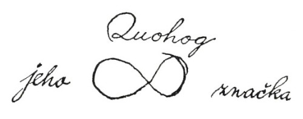

  

Jak jsme tak kráčeli na konec přístaviště k lodi, Kvíkveg s harpunou v ruce, zavolal na nás drsným hlasem kapitán Peleg ze svého vigvamu, že prý netušil, že můj přítel je lidojed, a kromě toho prohlašoval, že na loď nepustí žádného divocha, dokud se neprokáže svými papíry.

„Co to má znamenat, kapitáne Pelegu?“ otázal jsem se a vyskočil jsem na zábradlí, nechávaje svého přítele na břehu.

„To znamená,“ odpověděl, „že musí ukázat svoje listiny.“

„Ano,“ řekl Pelegovi za zády kapitán Bildad svým dutým hlasem a vystrčil hlavu z vigvamu. „Musí dokázat, že je obrácen na víru. Synu temnot,“ obrátil se ke Kvíkvegovi, „jsi nyní v lůně některé křesťanské církve?“

„Ovšemže,“ prohlásil jsem, „je přece členem První kongregační církve.“ Tady nutno podotknout, že četní tetovaní divoši plující na lodích z Nantucketu dají se nakonec obrátit na křesťanskou víru.

„První kongregační církev?“ zvolal Bildad. „Co! To chodí na služby boží do modlitebny jáhna Deuteronomie Colemana?“ To řka, sňal brýle, očistil je velkým žlutým šátkem, bíle kropenatým, nasadil si je opět pozorně, vyšel z vigvamu, a nahnuv se prkenně přes zábradlí, zadíval se dlouhým, zkoumavým pohledem na Kvíkvega.

„Jak dlouho je členem?“ obrátil se potom ke mně, „myslím, že moc dlouho ne, mladíku.“

„Ne,“ řekl Peleg, „a jistě nebyl ani řádně pokřtěn, poněvadž by mu to bylo smylo z obličeje aspoň trochu té ďáblovy šmolky.“

„Nuže, řekněte nám,“ zvolal Bildad, „je tento Filištín řádným členem jáhnových biblických shromáždění? Jakživ jsem neviděl, že by tam chodil, ač chodím kolem každý den Páně.“

„Nevím nic o jáhnových biblických shromážděních,“ odpověděl jsem, „jenom vím, že tadyhle Kvíkveg jest rozeným členem První kongregační církve. Je sám jáhnem. Ano, to také Kvíkveg je.“

„Mladíku,“ řekl Bildad přísně, „ty si ze mne tropíš šašky – vyslov se zřetelněji, ty mladý Chetite! Kterou církev vlastně myslíš? Odpověz mi!“ Takto zahnán do úzkých, odpověděl jsem: „Myslím, pane, tu starodávnou katolickou církev, k níž patříme vy a já a tamhle kapitán Peleg a tadyhle Kvíkveg a my všichni, zkrátka všichni lidé bez výjimky a vůbec každý; velká a věčná církev, shromáždění celého toho lidstva, které se modlí k Bohu; k té patříme; jen někteří z nás si libují ve vrtoších, jež se nijak nevztahují k této vznešené víře; v té si všichni podáváme ruce.“

„Spojujeme, to chceš říci, spojujeme ruce,“ zvolal Peleg, přistupuje blíže. „Mladý muži, ty bys měl jít spíše za misionáře než za námořníka; jakživ jsem neslyšel lepší kázání. Jáhen Deuteronomie – ani sám otec Javor by to lépe nedovedl, a ten už něco znamená. Pojď sem nahoru, pojď na palubu, nestarej se o dokumenty. Povídám, řekni tamhle Kvuhogovi – jakže se jmenuje? Řekni Kvuhogovi, aby sem šel. Při velké kotvě! Ten má ale harpunu! Zdá se, že je velmi dobrá. A dobře s ní zachází. Povídám, Kvuhogu, či jak se jmenuješ, už jsi někdy stál na přídi velrybářského člunu? Už jsi někdy harpunoval nějakou rybu?“

Nepromluviv ani slova, Kvíkveg podle svého divokého mravu vyskočil na zábradlí a odtud na příď jednoho velrybářského člunu, visícího na boku lodi; potom ohnul levé koleno, a namířiv harpunu, zvolal asi toto:

„Kapitáne, vy vidět tu malou kapku dehtu na vodě tam? Vy ji vidět? Tak myslet si, že to velryba oko, tak!“ Namířil pečlivě, mrštil železem přímo nad širákem starého Bildada přes celou palubu a zasáhl třpytivou dehtovou skvrnu daleko z dohledu.

„Ták,“ řekl Kvíkveg klidně, přitahuje k sobě šňůru, „to být oko velryba; velryba mrtvá.“

„Rychle, Bildade,“ zvolal Peleg na svého společníka, který ustoupil ke schodům do kajuty, polekán blízkostí letící harpuny. „Povídám, pospěš si, Bildade, a připrav lodní papíry. Musíme toho Hehoka, totiž míním Kvohoka, získat pro jeden náš člun. Podívej se, Kvohoku, dáme ti devadesátý vklad, a to je víc, než vůbec kdy dostal některý harpunář plující z Nantucketu.“

Šli jsme tedy do kajuty a k mému velkému potěšení byl Kvíkveg brzo najat do mužstva téhož člunu, ke kterému jsem patřil já.

Po skončení formalit, když Peleg měl listiny připraveny k podpisu, obrátil se ke mně a řekl: „Myslím, že Kvohok neumí psát, co? Povídám, Kvohoku, u čerta, podpisuješ se jménem nebo maluješ značku?“ Kvíkveg, který se již dvakrát nebo třikrát zúčastnil podobných obřadů, nevypadal při této otázce nijak zahanben. Chopil se nabídnutého pera a na patřičném místě obkreslil na papír přesnou napodobeninu zvláštního zaobleného obrazce, vytetovaného na paži; pokud šlo o divochovo jméno, kapitán Peleg umíněně setrvával při svém omylu, takže to na papíře vypadalo asi takto:

  

Kapitán Bildad zatím vážně seděl a upřeně pozoroval Kvíkvega. Konečně důstojně povstal, prohledal důkladné kapsy svého širokého hnědého pláště, vytáhl balík traktátů, vybral jeden s titulem „Soudný den přichází čili Nelze ztrácet času“ a dal jej Kvíkvegovi do rukou. Potom sevřel divochovy ruce i s knížkou oběma svýma rukama, a dívaje se mu vážně do očí, řekl: „Synu temnot, musím vykonat svou povinnost k tobě. Jsem podílníkem na této lodi a cítím se odpověden za duše celé její posádky. Přidržuješ-li se dosud pohanských způsobů, čehož se tuze obávám, důtklivě tě prosím, nezůstávej již déle ďáblovým nevolníkem. Odvrhni od sebe modlu Bála a ohavného draka; zachraň se před přicházejícím hněvem. Střež se, povídám ti! Ach, pro milosrdenství boží, stoč kormidlo pryč od horoucího pekla!“

V řeči starého Bildada se ještě ozývalo slané moře, a bylo nestejnorodě pomícháno se slovními obraty z Písma a domácího života.

„Počkej, počkej, Bildade, počkej, nebo nám zkazíš našeho harpunáře,“ volal Peleg. „Pobožní harpunáři nikdy nejsou dobří lovci – ztratí všecku výbojnost; harpunář nestojí za fajfku tabáku, není-li v něm kus lumpa. Mladý Nat Swaine býval kdysi nejsmělejším velitelem člunu z celého Nantucketu a Vineyardu; ale dal se na modlení a už z něho nic kloudného nebylo. Tolik se třásl o tu svou proklatou duši, že se před velrybami krčil a uhýbal ze samého strachu před nenadálým úderem, aby se snad člun nepřevrhl a on se neutopil.“

„Pelegu, Pelegu!“ řekl Bildad, pozdvihnuv oči a ruce, „ty sám stejně jako já prožils mnoho nebezpečných chvil, ty víš, Pelegu, co je to mít strach ze smrti. Jak tedy můžeš takhle bezbožně žvanit! Obelháváš své srdce, Pelegu. Řekni mi, když tuhle Pequod přišla o své tři stožáry, jak jí je tajfun smetl přes palubu u Japonska na té plavbě, kdy jsi byl prvním důstojníkem u kapitána Achaba, řekni, nemyslels tenkrát na smrt a na Poslední soud?“

„Slyšíte ho, slyšíte ho,“ křičel Peleg, přecházeje po kajutě a zarývaje ruce hluboko do kapes, „jen si ho oba poslechněte! Představte si to! Když jsme mysleli, že se loď každým okamžikem potopí! Tehdy myslet na smrt a na Poslední soud? Co? Když všechny tři stožáry neustále jako údery hromu buší do boku lodi a moře se převaluje přes příď i záď – tehdy myslet na smrt a na Poslední soud? Ne, to nebylo kdy myslet na smrt. Na život jsme tehdy mysleli, kapitán Achab a já, a jak zachránit celou posádku – jak postavit nouzové stožáry a jak se dostat do nejbližšího přístavu, na to jsem tenkrát myslel.“

Bildad již neřekl ani slovo, ale zapjal si plášť až ke krku a kráčel na palubu, kam jsme ho následovali. Tam stál a zcela klidně pozoroval několik lodníků, kteří na střední palubě spravovali vrchní plachtu. Občas se sehnul a zvedl záplatu nebo kousíček dehtové příze, která by jinak přišla nazmar.
